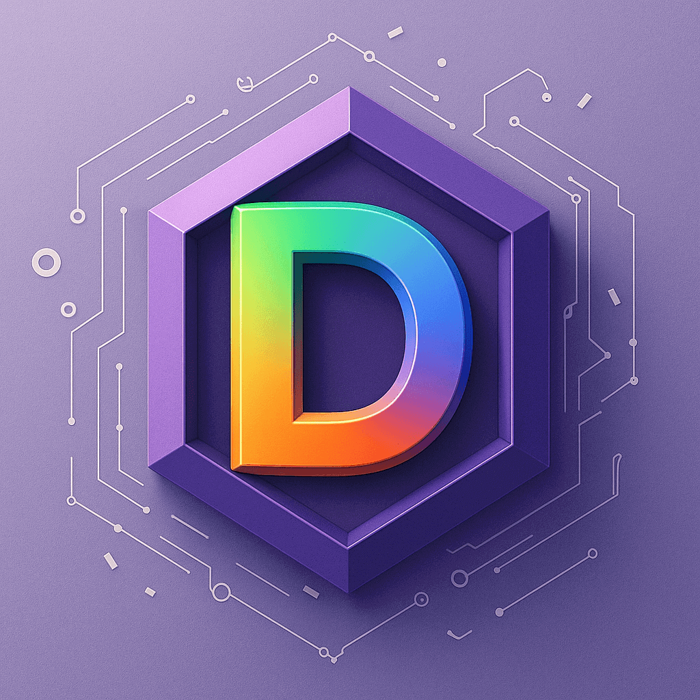
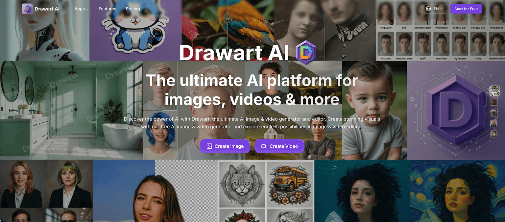

  

<h1 align="center">Clipin AI</h1>

  <strong>Create AI short videos from a single idea.</strong>

  <a href="https://clipin.ai">Website</a>
  ·
  <a href="https://clipin.ai/create">Start Creating</a>
  ·
  <a href="https://clipin.ai/apps/video-generator">AI Video Generator</a>
  ·
  <a href="https://clipin.ai/blog">Blog</a>

  
  
  

  

## AI Video Generator For Short-Form Content

[Clipin AI](https://clipin.ai) is a browser-based AI video generator for creators, marketers, agencies, educators, founders, and product teams. Turn prompts, images, scripts, and product ideas into ready-to-share short videos with AI-generated scripts, scenes, voiceovers, captions, music, and video clips.

Clipin is designed for TikTok, Instagram Reels, YouTube Shorts, product demos, social ads, educational explainers, creator content, and fast campaign iteration.

## What You Can Create

| Use case | What Clipin helps with |
| --- | --- |
| Text to video | Generate short videos from prompts, scripts, hooks, or content briefs. |
| Image to video | Animate product shots, portraits, references, and still images into video clips. |
| Social video | Create vertical videos for TikTok, Reels, Shorts, ads, launches, and announcements. |
| Product storytelling | Build demos, feature explainers, ecommerce videos, and campaign assets. |
| Visual assets | Generate images, edit photos, create thumbnails, and prepare storyboard references. |

## Core Tools

- [AI Video Generator](https://clipin.ai/apps/video-generator) for text-to-video and image-to-video clips.
- [AI Image Generator](https://clipin.ai/apps/image-generator) for thumbnails, references, storyboards, and campaign visuals.
- [AI Image Editor](https://clipin.ai/apps/image-editor) for plain-language photo editing and creative adjustments.
- [Create Workspace](https://clipin.ai/create) for turning an idea into a structured short-video workflow.

## From Idea To Finished Short Video

1. Describe your video idea, product, image, script, or content brief.
2. Review the generated structure, scenes, and creative direction.
3. Generate clips, captions, voiceover, music, and supporting visuals.
4. Refine the result and prepare it for short-form publishing.

## Who Uses Clipin

Clipin is built for content creators, social media managers, indie makers, SaaS teams, ecommerce brands, agencies, educators, designers, and founders who need high-quality short-form video content without traditional editing overhead.

## Links

- Website: [https://clipin.ai](https://clipin.ai)
- Create: [https://clipin.ai/create](https://clipin.ai/create)
- AI Video Generator: [https://clipin.ai/apps/video-generator](https://clipin.ai/apps/video-generator)
- AI Image Generator: [https://clipin.ai/apps/image-generator](https://clipin.ai/apps/image-generator)
- AI Image Editor: [https://clipin.ai/apps/image-editor](https://clipin.ai/apps/image-editor)
- Pricing: [https://clipin.ai/pricing](https://clipin.ai/pricing)
- Blog: [https://clipin.ai/blog](https://clipin.ai/blog)
- Support: [support@clipin.ai](mailto:support@clipin.ai)

